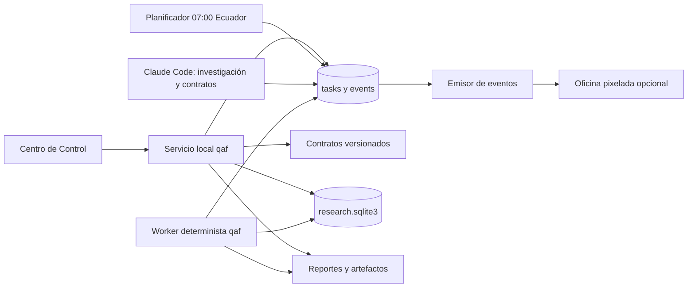

# Centro de control visual y automatización — propuesta

Fecha: 2026-09-22

## Decisión principal

Construir primero un **Centro de Control de Investigación** conectado al estado real de `qaf`. La oficina pixelada puede añadirse como vista secundaria para presencia y actividad, pero no debe ser la fuente de verdad ni el lugar donde se deciden resultados científicos.

El producto debe permitir que una persona no técnica pueda:

1. describir un objetivo de investigación;
2. escoger entre candidatos documentados con una recomendación explicada;
3. ver qué etapa está ejecutándose y qué evidencia produjo;
4. saber por qué una hipótesis falló y cuál es la siguiente acción válida;
5. abrir un reporte completo sin leer terminales ni archivos JSON;
6. distinguir trabajo real, espera, bloqueo, error y necesidad de decisión humana.

## Dos capas visuales distintas

### 1. Centro de Control — obligatorio

Es una interfaz funcional sobre el pipeline. Lee y escribe contratos versionados y muestra evidencia real.

Pantallas mínimas:

- **Inicio:** campañas activas, candidatos en cola, procesos en ejecución, decisiones pendientes y último resultado.
- **Crear investigación:** objetivo, mercado, timeframe, familia, holding máximo y restricciones. No pide parámetros técnicos al usuario salvo que quiera editarlos.
- **Selector de candidatos:** tarjetas como “KAMA tendencial”, “Donchian + ER” o “media móvil + banda”, cada una con fuente, mecanismo, compatibilidad con datos, fricción esperada y razón de recomendación.
- **Pipeline:** Investigación → contrato → datos → IS → diagnóstico → congelación → OOS → veredicto. Cada etapa muestra `pendiente`, `trabajando`, `bloqueada`, `fallida` o `completada`.
- **Resultados:** métricas, gates, curva, costos, estabilidad temporal, explicación en lenguaje sencillo y enlaces a evidencia.
- **Decisiones:** una bandeja pequeña para elecciones que sí requieren al usuario; por ejemplo, abrir OOS de un candidato congelado.
- **Biblioteca:** fuentes, autores, patrones, implementaciones y resultados acumulados, incluidos los fallidos.

La fuente de verdad debe seguir siendo el repositorio:

- contratos: `config/strategies/*.json`;
- universo y costos: `config/instruments.json`;
- catálogo de hipótesis: `docs/hypotheses/_registry.md` durante la transición;
- ejecuciones: `state/research.sqlite3`;
- evidencia: `reports/factory/runs/*/result.json` y reportes HTML;
- datos: manifiesto y particiones existentes.

### 2. Oficina de agentes — opcional

Sirve para saber de un vistazo si Claude Code está leyendo, escribiendo, ejecutando, esperando permiso o inactivo. No demuestra que el análisis sea correcto ni que un agente esté progresando científicamente.

Se puede usar Pixel Agents o Pixel Office como visor separado. Ambos observan sesiones de Claude Code; Pixel Office añade vista independiente, modo kiosco, API y posibilidad de reportar procesos personalizados. Para esta fábrica, Pixel Office encaja mejor si se quiere mostrar también al minero diario y no solo terminales Claude.

Estados visuales recomendados:

- investigador en biblioteca: buscando y clasificando evidencia;
- protocolista en mesa de diseño: convirtiendo hipótesis en reglas;
- motor en laboratorio: ejecutando AED/backtest;
- validador en sala de revisión: evaluando robustez/OOS;
- bloqueado: señal visible con el motivo exacto;
- terminado: entrega enlazada al reporte.

La animación debe derivarse de eventos reales emitidos por el pipeline, no de temporizadores ni de texto inventado.

## El bucle que hoy falta cuando una estrategia falla

Un resultado negativo es información, pero hoy no se convierte automáticamente en una siguiente acción. Debe existir una tabla de causas y rutas permitidas:

| Causa observada | Interpretación | Siguiente acción válida |
|---|---|---|
| No hay efecto antes de costos | La hipótesis de precio no aparece | Archivar; elegir otro mecanismo o mercado |
| Edge bruto positivo, costos lo destruyen | Economía incompatible con instrumento/holding | Acortar holding, cambiar vehículo o buscar edge por operación mayor como hipótesis nueva |
| Funciona en un solo subperiodo | Régimen inestable | Investigar un filtro causal de régimen con evidencia previa, o archivar |
| Muy pocas operaciones | Evidencia insuficiente | Replicar preespecificadamente en más activos o ampliar historia; no bajar el mínimo después de ver el resultado |
| Gate 0 falla | Resultado no interpretable | Reparar/adquirir datos; no ajustar la estrategia |
| Familia no implementada | Limitación del motor | Crear y probar la familia con tests causales antes de registrar el candidato |
| Error técnico | No es un veredicto de estrategia | Corregir, repetir con el mismo contrato y dejar trazabilidad |

Regla: un candidato fallido nunca se “rescata” ajustando parámetros a posteriori. Cualquier variante requiere una nueva hipótesis registrada con una razón independiente del resultado que se intenta corregir.

## Biblioteca de estrategias

Gemini Deep Research puede ayudar como **recolector externo**, pero no debe escribir directamente contratos ejecutables ni decidir qué estrategia es válida. Su entrega debe ser un dossier estructurado y verificable.

Campos mínimos por patrón:

- nombre y familia;
- regla original con cita primaria y página/sección cuando exista;
- mercado, periodo y vehículo de la evidencia original;
- mecanismo económico o conductual reclamado;
- datos necesarios;
- regla causal implementable;
- parámetros fijados por fuente y parámetros realmente libres;
- holding esperado y modelo de costos relevante;
- evidencia favorable y evidencia contraria;
- riesgos de extrapolar a CFD Darwinex;
- estado: `idea`, `documentada`, `implementable`, `bloqueada`, `probada`, `descartada`, `congelada`, `validada`;
- historial inmutable de pruebas relacionadas.

Antes de ofrecer un candidato en la interfaz, el sistema debe comprobar:

1. que existe una fuente identificable;
2. que el universo tiene los datos requeridos;
3. que el motor implementa la familia;
4. que el contrato cabe en H1/H4/D1;
5. que la estimación previa de fricción no vuelve absurda la idea;
6. que no es una repetición disfrazada de una hipótesis descartada.

## System One / Jev

Jev no reemplaza Claude Code, al investigador ni al motor numérico. Está diseñado para decisiones estrechas con salida tipada: elegir una clase, asignar un score o estimar una probabilidad sobre un estado ya preparado.

Usos potenciales en una fase posterior:

- clasificar el motivo de bloqueo de una ejecución;
- puntuar si un dossier cumple los campos de entrada;
- enrutar una tarea a `investigator`, `protocol`, `engine` o `validator`;
- priorizar candidatos según una rúbrica fija;
- detectar qué resultados necesitan revisión humana.

Usos incorrectos:

- inventar estrategias;
- interpretar literatura extensa sin una fase previa de extracción;
- sustituir gates deterministas;
- decidir si una estrategia gana o pierde;
- alterar parámetros después de ver IS/OOS.

Recomendación: no integrarlo ahora. Está en acceso temprano y el proyecto todavía no tiene el bus de eventos ni el esquema de tareas que Jev necesitaría. Primero se implementa la misma interfaz de decisión con reglas deterministas. Después se compara Jev contra un LLM mediante el adaptador oficial compatible, midiendo exactitud, costo, latencia y estabilidad sobre un conjunto de decisiones ya etiquetadas.

## Arquitectura propuesta



La pieza nueva esencial es un modelo explícito de `tasks` y `events`. El registro actual guarda ejecuciones, pero no representa investigación, redacción de contratos, espera humana ni bloqueos previos al backtest.

Esquema mínimo de tarea:

```json
{
  "task_id": "...",
  "hypothesis_id": "004",
  "stage": "research|protocol|data|is|freeze|oos|verdict",
  "owner": "investigator|protocol|engine|validator|human",
  "status": "queued|running|blocked|failed|completed|cancelled",
  "reason_code": "...",
  "reason_text": "...",
  "input_refs": [],
  "output_refs": [],
  "started_at": "...",
  "heartbeat_at": "...",
  "finished_at": "..."
}
```

## Orden de implementación

### Ahora — hacer visible lo que ya existe

1. Crear esquema `tasks/events` y migración de SQLite.
2. Emitir eventos desde `qaf.runner`, `Registry` y holdout.
3. Crear panel local de solo lectura con campañas, cola, bloqueos, resultados y enlaces.
4. Convertir el registro Markdown de hipótesis a JSON/SQLite validado; generar el Markdown para lectura humana.
5. Añadir códigos de razón estables a cada descarte/bloqueo.

### Siguiente — controlar el trabajo sin terminal

1. Formulario guiado para objetivos y candidatos.
2. Validación previa de compatibilidad de datos, familia y costos.
3. Botones seguros para registrar, ejecutar IS, congelar y abrir OOS con las autorizaciones actuales.
4. Planificador diario de las 07:00 `America/Guayaquil`, con bloqueo de solapamiento y resumen de cierre.
5. Notificación solo para finalización, fallo o decisión humana.

### Después — biblioteca y visualización lúdica

1. Importador de dossiers externos con revisión y deduplicación.
2. Pixel Office como vista de actividad alimentada por eventos reales.
3. Benchmark de Jev/adapter contra reglas y LLM sobre decisiones estrechas ya etiquetadas.
4. Incorporar otro proveedor solo donde la evaluación demuestre ahorro o mejor calidad.

## Criterios de éxito

- Desde la interfaz se entiende en menos de un minuto qué está trabajando, qué está bloqueado y qué requiere al usuario.
- Cada estado visual tiene un archivo, fila o evento verificable detrás.
- Un fallo siempre termina con causa y siguiente acción permitida.
- Ningún agente puede abrir OOS, cambiar una spec congelada o declarar aprobación por texto libre.
- El proceso diario puede terminar con cero estrategias aprobadas sin considerarse un error operativo.
- Tokens y modelos se registran por tarea cuando la plataforma los expone; el panel compara costo por candidato y por estrategia sobreviviente.

## Fuentes evaluadas

- TypeSafe AI, “Introducing System One Models & Jev”: https://typesafe.ai/blog/introducing-system-one-models-and-jev
- Documentación de TypeSafe: https://docs.typesafe.ai/introduction
- Adaptador System One para OpenAI, Anthropic y Gemini: https://github.com/typesafe-ai/system-one-adapter-python
- Pixel Agents: https://github.com/pablodelucca/pixel-agents
- Pixel Office: https://github.com/fedevgonzalez/pixel-office
