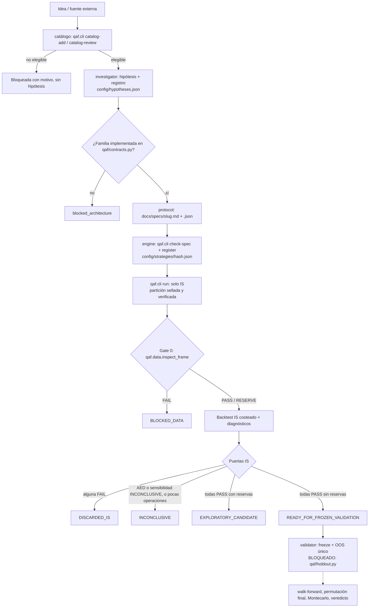

# Arquitectura del pipeline — QuantAgentFactory

Mapa del proceso tal como corre hoy en el código (`qaf/`), escrito para que otra IA o una sesión nueva lo entienda sin historial de chat. Reglas de método: `CLAUDE.md`. Quién edita qué: `AGENTS.md`. Estado: `PROJECT_STATE.md`.

## Resumen en una frase
Una hipótesis registrada se traduce a un contrato numérico, se ejecuta solo sobre In-Sample y tiene que pasar todas las puertas IS — calidad de datos, confirmación estadística de la señal (AED), costos, baseline con el mismo capital, estrés, sensibilidad de parámetros — para quedar lista para una validación OOS que hoy está deliberadamente cerrada. Cada fallo queda documentado con su razón; nada se descarta en silencio.

## Alcance (detalle en CLAUDE.md)
- Mercados: CFDs (índices, forex, materias primas) y futuros. Bróker de referencia: Darwinex (MT5), solo lectura de datos.
- Frecuencia: H1, H4 o D1. Nunca por debajo de H1. Excluido: scalping, alta frecuencia, rebalanceo de cartera.

## Flujo real

Los estados `J0`–`J3` y `H0` son decisiones de `qaf/validation.py::screening_gates` y `qaf/runner.py::execute`; se guardan en `reports/factory/runs/<run_id>/result.json`. `validator` traduce `BLOCKED_DATA` y las reservas sin confirmar a `INVALID_POR_DATOS` (CLAUDE.md regla 20) y actualiza el estado en `config/hypotheses.json` y su espejo `docs/hypotheses/_registry.md`.

## Orquestación: controlador de fases determinista (`qaf/pipeline.py`)
No hay un quinto agente coordinador. El orden lo decide código de solo lectura que deriva la fase de cada hipótesis de sus artefactos y dice a qué agente le toca:

| Fase | Condición | Le toca a |
|---|---|---|
| `NEEDS_HYPOTHESIS_DOC` | hipótesis `pending`/`ready` sin `docs/hypotheses/<slug>.md` | investigator |
| `NEEDS_SPEC` | sin contrato `docs/specs/*.json` con su `hypothesis_id` | protocol |
| `NEEDS_REGISTRATION` | contrato sin `config/strategies/<digest>.json` idéntico | engine (`check-spec` + `register`) |
| `NEEDS_IS_RUN` | registrado sin corrida en SQLite | engine (`qaf.cli run`) |
| `RUNNING` | corrida o tarea en curso | nadie (esperar o recuperar) |
| `NEEDS_VALIDATOR_REVIEW` | corridas terminadas y estado todavía `pending`/`ready` | validator |
| `FROZEN_VALIDATION_BLOCKED` | estado `ready_for_frozen_validation`: lista para *entrar* en validación congelada, no validada | validator (bloqueado por `qaf/holdout.py`) |
| `BLOCKED` / `NEEDS_DECISION` / `APPROVED` | bloqueo externo, muestra o datos insuficientes, incubación | Alexander |
| `CLOSED` | descartada o rechazada | nadie; reabrir = hipótesis nueva |
| `INCONSISTENT` | artefactos contradictorios en una hipótesis activa (estrategia registrada distinta de su contrato, contrato sin narrativa, estado desconocido) | Alexander |

Antes de invocar un agente: `python -m qaf.pipeline --hypothesis <id> --as <agente>` (0 = permitido, 3 = detenerse). El vínculo entre fases es por contenido: `digest(spec)` nombra la estrategia registrada y `canonical(spec)` identifica sus corridas en `state/research.sqlite3`, así que una spec editada después de registrar se detecta sola. Las tareas y eventos que registra `qaf/registry.py` (cola del catálogo, corridas) son una entrada más del controlador, no una fuente de orden paralela.

## Puertas IS (todas obligatorias en el flujo normal; un diagnóstico ausente es FAIL)

| Puerta | Qué mide | Umbral | Dónde |
|---|---|---|---|
| `minimum_trades` | tamaño de muestra | `config/runner.json: min_trades` | `screening_gates` |
| `net_positive` | P&L neto después de todos los costos | > 0 | `screening_gates` |
| `profit_factor` | ganancias/pérdidas netas | > `min_profit_factor` (1.3) | `screening_gates` |
| `equity_drawdown` | drawdown máximo de equity marcada | ≤ `max_drawdown_fraction` | `screening_gates` |
| `friction` | neto / costos pagados (regla 17) | ≥ 3.0 | `qaf/metrics.py` |
| `stress_net_positive` | neto con fricción ×2 | > 0 | `diagnose` |
| `bootstrap_lower_bound` | IC 95% del R medio (bootstrap de bloques) | límite inferior > 0 | `qaf/metrics.py` |
| `beats_baseline` | comprar y mantener, mismo símbolo/timeframe/IS/costos/capital 1x (regla 19) | estrategia > 0 y > baseline | `qaf/baseline.py` |
| `aed_pattern_confirmed` | permutación por rotación de la señal cruda, sin costos ni SL/TP (regla 5) | p < 0.05; `INCONCLUSIVE` si < 20 señales | `qaf/aed.py` |
| `parameter_sensitivity` | ±10/20% por parámetro + 200 vecinos Montecarlo ±20% (regla 14) | percentil de la spec ≤ 0.8 y ≥ 50% de vecinos con neto > 0 (provisional) | `qaf/validation.py` |

`RESERVE` en Gate 0, `costs_verified=false` o una partición sin sello limitan la decisión a `EXPLORATORY_CANDIDATE`: se puede investigar en IS, nunca aprobar.

## Modelo de ejecución (`qaf/engine.py`)
- Señal al cierre de la barra t, entrada al open de t+1 (regla 21).
- Stop a mercado, target límite. Si ambos se tocan en la misma barra, cuenta el stop. Un gap a través del stop se llena al open; a través del target, al target (conservador).
- Salida por tiempo al open de la barra `entrada + max_holding`. Solo un gap en ese open (stop o target) la precede; los toques intrabar de esa barra no aplican porque la posición ya se cerró. Decidir al open según el rango posterior sería look-ahead.
- Tamaño por riesgo (`risk_fraction` del capital sobre la distancia al stop), acotado por margen y volumen del contrato.

## Datos e integridad IS/OOS
- `data/clean/<símbolo>/<TF>/{IS,OOS}.parquet`, corte fijo por símbolo en `data/clean/manifest.json`.
- Sello (`python -m qaf.partition seal`; `qaf.ingest` sella al crear): sha256 de ambos archivos, esquema y rango temporal leídos del footer parquet. De OOS solo se leen el footer y la columna `time`, nunca precios.
- Cada `qaf.cli run` verifica el hash de IS y OOS contra el sello y que IS termine antes del corte. Hash distinto → la serie queda no disponible. Sin sello → reserva que bloquea la validación final.

## Agentes: qué leen, qué escriben, qué los detiene

| Agente | Lee | Escribe | Se detiene si... |
|---|---|---|---|
| investigator | catálogo `state/catalog/`, literatura, `config/hypotheses.json` | revisión de evidencia vía `qaf.cli catalog-review/promote` | la idea está fuera de alcance o no tiene fuente primaria |
| protocol | hipótesis, `config/instruments.json`, `docs/universe.md` | `docs/specs/<slug>.md` + `.json` | la familia no existe en `qaf` o la regla no es numérica |
| engine | spec JSON, datos IS | `config/strategies/<hash>.json`, `reports/factory/runs/<run_id>/` (vía `qaf.cli`) | `check-spec` falla; nunca escribe backtests fuera de `qaf` |
| validator | `result.json` | estado en `config/hypotheses.json` + espejo; veredicto | la decisión no es `READY_FOR_FROZEN_VALIDATION`; OOS está cerrado |

## Qué falta (no presentado como hecho)
- Walk-forward real con reentrenamiento por ventana (regla 18): `diagnostics.walk_forward = NOT_IMPLEMENTED`. Las ventanas actuales son diagnóstico con parámetros fijos.
- Costos históricos variables (C4): el swap se aplica en efectivo por lote al valor actual sobre todo el histórico. Sobrestima la financiación cuando el precio histórico era más bajo — distorsiona sobre todo el baseline con mismo capital.
- Apertura OOS, contrato congelado y veredicto final: `qaf/holdout.py` falla cerrado; prerrequisitos en `docs/VALIDATION_ROADMAP.md`.
- Familias no implementadas (p. ej. calendario): la hipótesis queda `blocked_architecture`.
