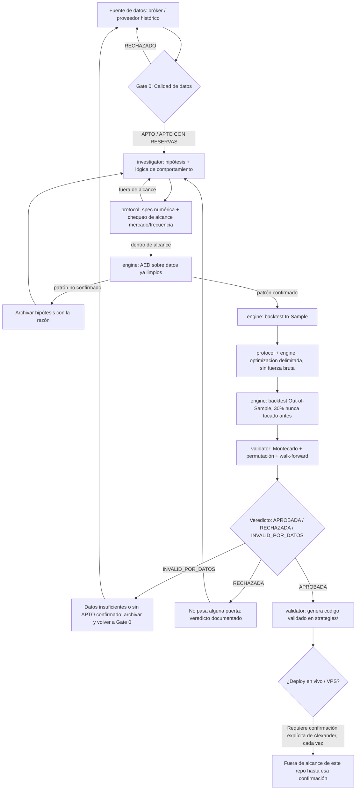

# Arquitectura del pipeline — QuantAgentFactory

Mapa completo del proceso. Escrito para que otra IA pueda revisarlo sin contexto adicional, y para que cualquier sesión futura entienda cómo se conectan los agentes sin depender del historial de chat.

## Resumen en una frase
Una hipótesis no se convierte en estrategia aprobada sin pasar, en orden, por: calidad de datos → confirmación estadística (AED) → reglas numéricas → backtest In-Sample → optimización limitada → backtest Out-of-Sample → robustez (Montecarlo/permutación/walk-forward) → veredicto. Cualquier fallo en el camino manda la hipótesis de vuelta a investigar, documentado — nunca se deja a medias ni se ignora en silencio.

## Alcance (detalle completo en CLAUDE.md)
- Mercados: CFDs (índices, forex, materias primas) + futuros.
- Frecuencia: diario o 4H, nunca menos.
- Excluido explícitamente: scalping, alta frecuencia, rebalanceo de cartera.
- Filosofía: la IA ejecuta código determinista ("obrero"); no genera ideas de mercado por intuición ("pensador").

## Grafo de decisión

## Agentes: qué lee cada uno, qué escribe, qué lo detiene

| Agente | Lee | Escribe | No avanza si... |
|---|---|---|---|
| investigator | docs/philosophy.md, literatura externa (WebSearch) | docs/hypotheses/\<slug\>.md | la idea es scalping/HFT/rebalanceo (se descarta antes de escribirla) |
| protocol | docs/hypotheses/\<slug\>.md | docs/specs/\<slug\>.md | el timeframe/mercado está fuera de alcance, o la regla no es numérica |
| engine | docs/specs/\<slug\>.md, data/ | reports/\<slug\>/data_quality.md, reports/\<slug\>/ (AED + backtest) | el Gate 0 de calidad falla, o el AED no confirma el patrón |
| validator | reports/\<slug\>/ (resultados de engine), docs/specs/\<slug\>.md (puertas) | reports/\<slug\>/verdict.md, strategies/\<slug\>/ (si aprueba) | cualquier puerta numérica falla, incluida la de costo de bróker |

Comunicación entre agentes: siempre por archivo, nunca por un mensaje de chat que se pierde al cerrar la sesión. Si un agente necesita algo que otro no dejó escrito, se detiene y lo pide — no asume ni inventa.

## Puertas numéricas — estado actual

| Puerta | Valor | Estado |
|---|---|---|
| Profit factor OOS | > 1.3 | Placeholder, confirmar |
| p-valor test de permutación | < 0.05 | Placeholder, confirmar |
| Máximo drawdown OOS | por estrategia | Sin default global todavía |
| Ratio expectancy / costo de bróker | ≥ 3.0 | Confirmado — CLAUDE.md regla 17 (usa `docs/cost_model.md`; las cifras de costo por símbolo siguen siendo borrador hasta confirmar bróker real) |
| Límite de parámetros libres por estrategia | 3-4 | Confirmado — CLAUDE.md regla 16 |
| Split In-Sample / Out-of-Sample | 70/30, separación física en archivos (`data/<símbolo>/IS.*` / `OOS.*`) | Confirmado — CLAUDE.md reglas 4 y 13 |
| Análisis de sensibilidad de parámetros | ±10-20% por parámetro libre, mínimo 200 iteraciones Montecarlo; la curva original debe quedar al centro del abanico | Confirmado — CLAUDE.md regla 14 |
| Puerta de baseline obligatoria | superar "comprar y mantener" del mismo activo, mismos costos, misma ventana OOS | Confirmado — CLAUDE.md regla 19 |
| Punto dulce de componentes estructurales | 4-8 componentes (señal de entrada, filtro, SL, TP, salida por tiempo); sospecha si hay menos de 2 o más de 12 | Confirmado — CLAUDE.md regla 16 (distinto del tope de 3-4 parámetros libres optimizables, misma regla) |

## Lo que todavía falta (para que la revisión externa lo sepa)
- Fuente de datos histórica y bróker de referencia sin decidir — bloquea correr cualquier hipótesis real de punta a punta.
- Skills de AED y backtest (`.claude/skills/`) todavía no existen como código — solo `data-quality-check` está definido.
- Ninguna hipótesis ha sido procesada todavía. Este documento describe el proceso, no un resultado.

## Por qué está diseñado así
La primera versión agrupaba 4 agentes por rol sin especificar cómo se pasaban información entre sí — procesos aislados. Esta versión fuerza el traspaso por archivo (hipótesis → spec → reporte → veredicto), documenta cada rechazo con su razón en vez de descartarlo en silencio, y agrega un gate de calidad de datos y un chequeo de costo de bróker que no existían en la primera pasada — sin eso, cualquier resultado estadístico corriente abajo es inválido o engañoso.
